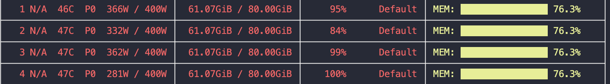
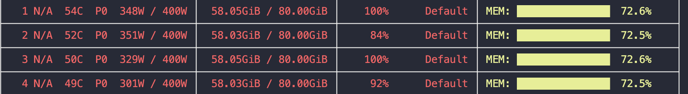
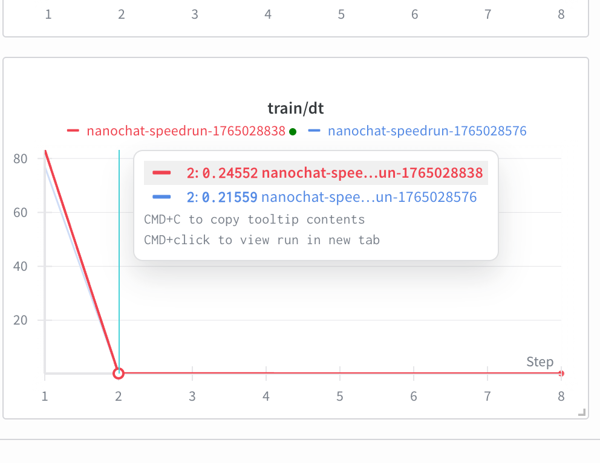
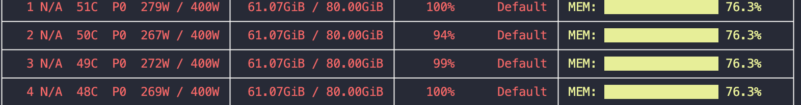
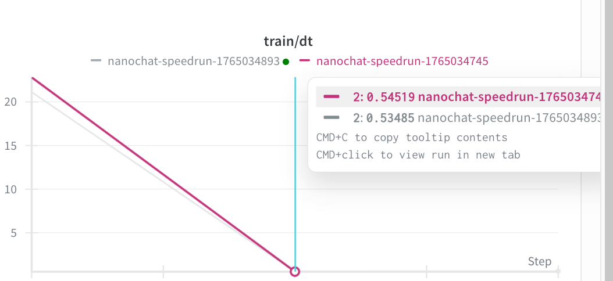

# Task 3: 优化训练效率

torch.compile 通过即时编译 (JIT) 技术，对 PyTorch 模型的前向和反向计算图进行优化，提升训练速度和资源利用率。原代码在 base 预训练和 midtraining 阶段均集成了 torch.compile，以提升整体训练性能。而混合精度也是在原版本中就已经采用的技术，用于在保证数值稳定性的前提下，提升计算吞吐量并降低显存占用。因此我主要从 1. 数据加载 2. Gradient Checkpointing 3. Liger-Kernel fused cross-entropy 三个方面来进行优化训练效率

## 1. 数据加载与预取

尝试一：

在 pretraining 中，原代码版本通过设置 `tokenizer_threads=4`使得在 tokenizer 内部用 4 个线程并行编码；且配合 tokenizer_batch_size=128，一次性对一小批文档做 BPE 编码，再把得到的 token 流统一塞进 deque token_buffer，最后用 pinned scratch 一次 view 成 (B, T) 送到 GPU。整体管线就是“parquet → 批量多线程 tokenize → token_buffer → scratch → (batch_size, max_seq_len)”。好处可以是在 CPU 侧把 BPE 编码做成“少次大批量、而不是多次小调用”，充分利用 tokenizer C++ 内核和多线程能力，显著降低 Python 调用和小 tensor 拼接的开销；同时通过 pinned memory + 一次性拷贝到 GPU，尽量把数据准备时间叠到 GPU 计算上，减少因等待数据而产生的空转。

因此我在 midtraining 也沿用了类似的设计思路，并进行了实验结果，发现不如预期结果并进行分析：

- **midtraining 自定义 DataLoader**

  - `scripts/mid_train.py` 中的 `mid_data_generator` 手写了一套针对 token 流的 DataLoader，基本思路是：
    - 先用 `TaskMixture` 把多个任务（SmolTalk/MMLU/GSM8K/拼写等）拼成一个“对话数据集”；
    - 对于每个 rank，从 `dataset[cursor]` 取出一条 `conversation`，通过 `tokenizer.render_conversation` 编成一串 token id，依次放进一个全局的 `deque token_buffer`。
    - **为了减少 Python 调用开销，新增了可选的批量多线程 tokenize：通过 `tokenizer_batch_size` 一次收集多条对话，用 `ThreadPoolExecutor(max_workers=tokenizer_num_workers)` 并行调用 `tokenizer.render_conversation`，然后再把这批 `ids` 统一塞进 `token_buffer`。**
    - 一直往 `token_buffer` 里塞 token，直到累计到 `needed_tokens = device_batch_size * max_seq_len + 1`；
    - 然后用一个 CPU 端的 1D `scratch` buffer（`torch.empty(needed_tokens, pin_memory=True)`）将这些 token 填满，切分出 `inputs_cpu = scratch[:-1]` 和 `targets_cpu = scratch[1:]`，再各自 `view` 成 `(device_batch_size, max_seq_len)`，最后用 `to(..., non_blocking=True)` 搬到 GPU。
    - 这样可以避免频繁构造小 tensor/拼接大 tensor，而是每一步只做一次大的拷贝和 reshape，同时利用 pinned memory + 多线程 tokenize 把数据准备时间尽量叠到 GPU 前向/反向上。
- 实验结果

  - 但实验中发现，midtraining 进行上述优化后，整体消耗时间并没减少还多了一点。分析原因，发现 midtraining 中并行运行 tokenizer.render_conversation 中，虽然 self.encode 内部会短暂释放 GIL，但 render_conversation 函数本身的逻辑（循环、字典访问、列表拼接）都需要持有 GIL。当使用 ThreadPoolExecutor 运行这个 Python 函数时，多个线程会频繁争抢 GIL。这个和 pretraining 中直接在 tokenizer.encode 内部释放 GIL 不同，导致 midtraining 反而因为多线程争抢 GIL 而变慢。
  - 因此在 midtraining 中的优化取消，保持和原版本一致。

尝试二：

目前的训练流程是，先准备数据，再进行GPU计算，再准备数据，再进行GPU计算，交替进行。但理想的流水线可能是 GPU 计算当前 batch 的同时，CPU 侧准备下一个 batch 的数据，这样可以最大化重叠数据准备和计算时间，减少 GPU 空转等待。这里不做实现，只作为优化思路。

---

## 2. Gradient Checkpointing

在显存用量不够的情况下，可以在 `nanochat/gpt.py` 中引入梯度检查点开关。主要目的是不保存中间激活态，而是在反向时重新计算前向，从而节省显存。

设计思路：

- 在 `GPTConfig` 增加 `gradient_checkpointing` 开关，由训练脚本通过 `--use_gradient_checkpointing=true` 传入，保证 checkpoint 元数据里也能记录这个标志，便于恢复。
- 在 `GPT.forward` 中按 block 粒度包裹 `torch.utils.checkpoint`，仅在「训练模式 + 无 KV cache」时启用；`use_reentrant=False` 以兼容 torch.compile。
- base/mid/SFT 三个训练脚本都提前设置 `model.config.gradient_checkpointing`，并在保存元数据时写回。

验证方式：

- 静态检查：`torchrun --standalone --nproc_per_node=$NPROC_PER_NODE -m scripts.base_train -- --depth=4 --run=$WANDB_RUN --use_gradient_checkpointing=1` 通过。
- 测试：在 base/mid/SFT 分别跑少量迭代（如 `--num_iterations=20`），观察 loss 下降、无 NaN/OOM。
- 显存验证：开启/关闭开关对比 `nvidia-smi` 或 `torch.cuda.max_memory_allocated` 峰值，确认激活占用下降；同时关注 `dt` 变长是预期的重算开销。
  - 重计算前：
    
    重计算后：
    
    二者在dt的时间对比，红色是重计算后，dt时间变多了
    

    结果均符合预期。

---

## 3. Liger-Kernel 加速算子（非常有效！）

- 安装：建议在已装好对应 CUDA 版本的 torch 之后执行 `uv add liger-kernel`。如需特定 CUDA/源码安装，参考官方仓库 https://github.com/linkedin/Liger-Kernel。
- 开关：训练脚本支持 `--use_liger_kernels=True`（base/mid/SFT）；模型会在运行时探测 liger 是否可用，未安装会提示并自动回退常规 CE。
- 实现思路：

  - 在gpt.py 的 GPTConfig 中增加 `use_liger_kernels` 标志，并在训练脚本中设置和保存元数据。
  - 在 GPT.forward 中，当 `use_liger_kernels` 启用且处于训练模式时，使用 `LigerFusedLinearCrossEntropyLoss`函数：

  ```
    if self.use_liger_ce:
      if self._liger_ce is None:
          self._liger_ce = LigerFusedLinearCrossEntropyLoss(
              ignore_index=-1,
              reduction='mean',
              softcap=softcap,
              accum_dtype=torch.float32,
          )
      x_flat = x.reshape(-1, x.size(-1))
      target_flat = targets.view(-1)
      loss = self._liger_ce(self.lm_head.weight, x_flat, target_flat)
      # loss = loss_out if isinstance(loss_out, torch.Tensor) else loss_out.loss

      return loss
  ```
- 实验结果（在 base_train.py 上测试）：

  - 显存占用：使用 Liger fused CE 后，显存占用相比常规 CE 降低约 50 GB！
    
    
  - 训练速度：在 A100 80G	B 上测试，使用 Liger fused CE 后，时间也降低了。
    

除了 `LigerFusedLinearCrossEntropyLoss`算子外，Liger 还提供了其它融合算子如 `LigerRMSNorm`等。可进行进一步提升效率。
