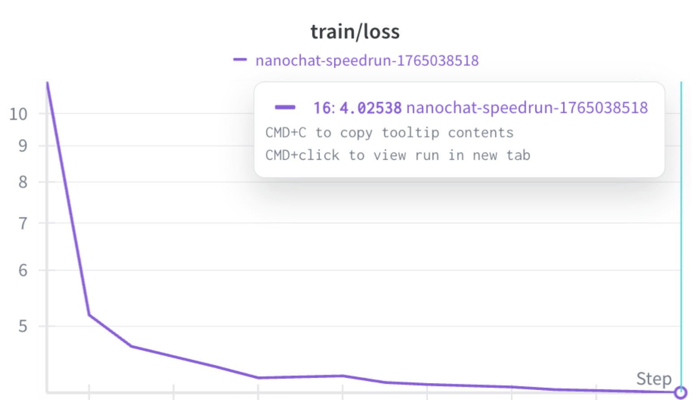

# 模型架构变体

该任务中，采用 SwiGLU 激活函数替换原有的 $\text{relu}^2$ MLP 结构，保持参数量基本一致并对比训练表现。

## 具体实现

- 配置入口：`nanochat/gpt.py` 的 `GPTConfig` 新增 `mlp_type`（默认 `relu2`，可选 `swiglu`）。
- MLP 分支（位于 `nanochat/gpt.py` 的 `MLP` 类）：
  - `relu2`：保持原 4× 扩张，全连接 → `relu().square()` → `c_proj`。
  - `swiglu`：双线性层 `w_gate`、`w_up`，隐藏维度取 $\text{hidden\_dim} = \frac{8}{3} \cdot n\_\text{embd}$，计算 $\text{silu}( \text{gate} ) \times \text{up}$ 后接 `c_proj`。该取值使参数量与 4× relu² MLP 持平，约为 $8 \times n\_\text{embd}^2$ 个权重。
- 使用方式：`scripts/base_train.py` 暴露 `--mlp_type` 并传入 `GPTConfig`，命令行即可切换基线/变体。

- 运行命令是
  `torchrun --standalone --nproc_per_node=$NPROC_PER_NODE -m scripts.base_train -- --depth=4 --run=$WANDB_RUN --mlp_type=swiglu`
## 训练1000步之后的对比

## 选择原因和期望效果
- SwiGLU 是目前 Transformer 的 默认 MLP 结构之一，包括在 PaLM、LLaMA 等大模型中均有采用，已被证明在多种任务上优于传统 ReLU MLP。
- 相比传统 ReLU/GeLU MLP，SwiGLU 在大模型中被广泛验证具有更好的表达能力与更平滑的梯度，能带来更稳定和更快的收敛。在保持参数量近似不变的情况下，用 SwiGLU 替代原始 MLP 是一个非常合理的架构变体。